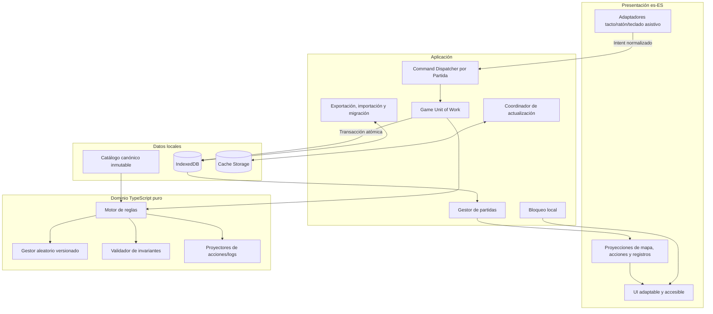
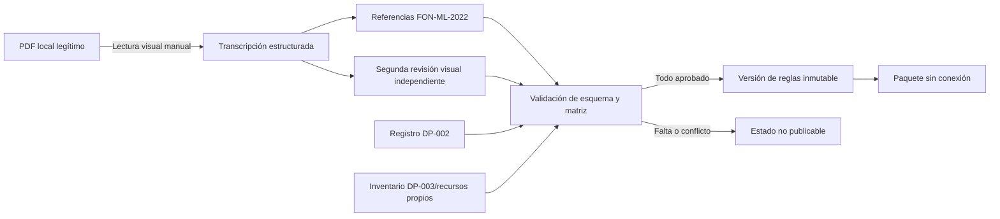
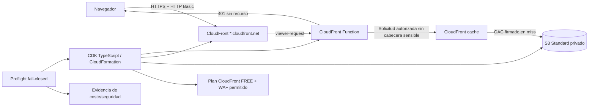

# Documento de diseño: Fields of Normandy PWA

## Overview

### Propósito

Este diseño convierte los requisitos aprobados de `fields-of-normandy-pwa` en una arquitectura implementable para una PWA de uso personal, íntegramente visible en español de España y ejecutada en el navegador. La versión base permite conservar y jugar Partidas independientes de exactamente las quince Misiones de `FON-ML-2022`; no contiene campañas, progresión entre Misiones, sincronización remota ni servicios dinámicos de juego.

`requirements.md` es la especificación normativa. El PDF local es únicamente una referencia funcional para la transcripción y revisión manual de hechos, topología y valores. El producto no incorporará capturas, prosa, ilustraciones, mapas ni contadores del PDF. Los binarios o renderizados locales usados durante la verificación no entrarán en el código fuente distribuible, los fixtures publicados ni el Paquete sin conexión. Los textos visibles serán redacción original en `es-ES` y los recursos visuales serán propios o estarán autorizados en el Inventario de licencias (requisitos 1, 3, 30 y 40).

### Objetivos de diseño

1. Mantener un núcleo de reglas TypeScript puro, determinista, data-driven e independiente de la Interfaz, IndexedDB, red, reloj y APIs de navegador.
2. Representar cada transición como una operación inmutable y confirmar conjuntamente Estado de partida, ambos registros y Estado aleatorio antes de permitir otra acción mutable.
3. Conservar varias Partidas aisladas, con exportación/importación manual, migraciones recuperables y ninguna sincronización con servidor.
4. Instalar y ejecutar todas las funciones de juego sin conexión mediante un Paquete sin conexión versionado y actualizaciones con validación previa y rollback.
5. Normalizar tacto y ratón como los mismos comandos de dominio; garantizar accesibilidad perceptiva y operable.
6. Publicar solo contenido canónico trazable, probado, con segunda revisión visual y permisos resueltos. DP-001, DP-002 o DP-003 pendientes mantienen bloqueado el elemento y toda Misión dependiente.
7. Servir recursos estáticos mediante el dominio `*.cloudfront.net`, CloudFront Function con HTTP Basic, S3 privado con OAC e infraestructura declarativa.
8. Aplicar un Bloqueo de producción por defecto que no acepte alertas ni estimaciones como prueba de coste cero y que exija evidencia vigente de cobertura gratuita de todas las operaciones S3 previstas.

### No objetivos y límites

- No se deducen mapas a partir de descripciones ni se inventan coordenadas, adyacencias, orientaciones, prioridades, desempates, límites, excepciones o reglas lúdicas.
- No se fija longitud, formato o rango de Semilla ni un algoritmo criptográfico obligatorio. Los algoritmos de aleatoriedad, integridad y verificación tienen identificadores versionados y contratos de compatibilidad; su selección concreta exige evidencia técnica y de seguridad.
- No se fija máximo de Partidas. La implementación demostrará al menos veinte en un Entorno probado y reaccionará a la capacidad observada.
- No se promete una generación de iPad ni una versión de iPadOS. La Matriz de conformidad registra cada combinación probada.
- No se cifra el almacenamiento como afirmación de confidencialidad. El Bloqueo local disuade el acceso casual a la Interfaz, no protege Datos descargados frente a quien controla el dispositivo.
- No se garantiza coste cero por diseño. Si no puede demostrarse en la cuenta y condiciones vigentes, no hay despliegue de producción.

### Investigación técnica y decisiones derivadas

- Se elige **IndexedDB** porque almacena datos estructurados, funciona sin red y todas sus lecturas/escrituras se realizan dentro de transacciones. Esto permite confirmar Instantánea, registros, Estado aleatorio e índice de Partida como una unidad; `localStorage` no ofrece el mismo contrato transaccional ni capacidad adecuada. Referencias: [Using IndexedDB](https://developer.mozilla.org/en-US/docs/Web/API/IndexedDB_API/Using_IndexedDB) e [IDBTransaction](https://developer.mozilla.org/en-US/docs/Web/API/IDBTransaction).
- Un **service worker** actúa entre la aplicación y la red y permite servir recursos desde caché. Se usará un protocolo propio de manifiesto íntegro y cachés `staging/current/previous`, no una actualización recurso a recurso. Referencia: [Caching en PWA](https://developer.mozilla.org/en-US/docs/Web/Progressive_web_apps/Guides/Caching).
- **CloudFront Functions** puede realizar autenticación básica/autorización en el evento `viewer-request`, antes de acceder al origen. El runtime 2.0 no dispone de variables de entorno ni red. Por ello, un generador de despliegue inyectará únicamente material verificador versionado en la función publicada; no se almacenarán credenciales en el repositorio, PWA, S3, artefactos permanentes de síntesis ni registros. No se adopta KeyValueStore porque no forma parte de la arquitectura aprobada. Referencias: [Customize at the edge with CloudFront Functions](https://docs.aws.amazon.com/AmazonCloudFront/latest/DeveloperGuide/cloudfront-functions.html) y [runtime 2.0](https://docs.aws.amazon.com/AmazonCloudFront/latest/DeveloperGuide/functions-javascript-runtime-20.html).
- **Origin Access Control** firma las solicitudes de CloudFront a S3 y permite bloquear el acceso público. Referencia: [AWS::CloudFront::OriginAccessControl](https://docs.aws.amazon.com/AWSCloudFormation/latest/TemplateReference/aws-resource-cloudfront-originaccesscontrol.html).
- La suscripción del plan se declarará como `AWS::PricingPlanManager::Subscription` con `PlanFamily=CloudFront` y `PlanTier=FREE`. La existencia del recurso declarativo no demuestra elegibilidad ni cobertura S3: el preflight debe comprobarlas en la cuenta. Referencias: [CloudFront flat-rate pricing plans](https://docs.aws.amazon.com/AmazonCloudFront/latest/DeveloperGuide/flat-rate-pricing-plan.html) y [AWS::PricingPlanManager::Subscription](https://docs.aws.amazon.com/AWSCloudFormation/latest/TemplateReference/aws-resource-pricingplanmanager-subscription.html).

El contenido consultado se ha resumido y parafraseado; no se reproduce documentación externa ni material expresivo del PDF.

### Trazabilidad de alto nivel

| Área de diseño | Requisitos cubiertos |
|---|---|
| Catálogo, publicación, fuente y recursos propios | 1-5, 30, 32, 33, 40; DP-001..003 |
| Motor, secuencias y reglas concretas | 5, 8-18, 32-39 |
| Partidas, atomicidad, aleatoriedad y registros | 6, 7, 19-22 |
| Persistencia, copia, migración y offline | 7, 21-23 |
| Interfaz, modalidades, idioma y accesibilidad | 3, 20, 24, 25, 31 |
| Acceso, alojamiento, coste y observabilidad | 26-29 |

## Architecture

### Vista lógica



### Regla de dependencias

Las dependencias solo apuntan hacia el dominio:

- `domain/` contiene tipos inmutables y funciones puras. No importa DOM, React, IndexedDB, Cache API, `Date`, `Math.random` ni SDK de AWS.
- `application/` coordina casos de uso, exclusión mutua por `gameId`, atomicidad y puertos; no interpreta reglas.
- `adapters/browser/` implementa IndexedDB, Cache API, descarga/subida de archivos, capacidades y entradas de usuario.
- `ui/` transforma proyecciones en presentación; no calcula elegibilidad, combate, Moral, Revelado ni desenlaces.
- `catalog/` contiene datos serializables y validadores generados. Ningún valor lúdico se codifica en componentes de UI o ramas ad hoc del motor.
- `infrastructure/` contiene CDK TypeScript, políticas y el preflight de producción; no es importado por la PWA.

Una estructura inicial compatible con estos límites es:

```text
src/
  domain/{engine,rules,random,invariants,geometry,logging}/
  application/{commands,games,backup,migrations,offline}/
  adapters/browser/{indexeddb,cache,capabilities,files,inputs}/
  catalog/{schemas,versions,FON-ML-2022}/
  ui/{views,components,a11y,locale}/
  service-worker/
infrastructure/{stacks,access,preflight,evidence}/
tests/{unit,property,integration,e2e,conformance}/
```

La tecnología de componentes visuales podrá seleccionarse durante implementación, pero deberá respetar estos puertos. El tablero se renderizará con gráficos vectoriales propios y una capa semántica equivalente; los datos geométricos proceden del Catálogo, no de imágenes del PDF.

### Flujo de publicación de contenido



El compilador de catálogo trabaja en modo fail-closed:

1. valida identificadores únicos, referencias, tablas completas/no solapadas y relaciones de inventario;
2. comprueba exactamente quince Misiones y sus datos verificados de requisitos 32-33;
3. exige `DP-001=resolved` y segunda revisión visual para cada mapa publicado;
4. exige que cada ambigüedad aplicable esté resuelta en DP-002;
5. exige recurso propio o permiso DP-003 documentado;
6. exige prueba aprobada por elemento en la Matriz de conformidad;
7. emite un catálogo inmutable con `rulesVersion` nuevo; nunca reescribe una versión publicada.

Una Misión puede existir en el catálogo de mantenimiento con `publicationStatus=blocked`, pero el selector jugable solo recibe Misiones `published`. No hay bandera de desarrollo que permita publicar saltándose el gate.

### Despliegue



Los recursos estáticos usan nombres con hash de contenido e inmutabilidad larga; el manifiesto de versión y el service worker usan una política de revalidación controlada. El despliegue sube primero una versión completa, valida su manifiesto y solo después cambia el puntero publicado. Ante fallo, el puntero y los objetos de la versión válida anterior permanecen disponibles. Las Partidas nunca residen en AWS.

La infraestructura se expresa en CDK TypeScript y recursos CloudFormation de bajo nivel cuando sea necesario:

- bucket S3 Standard con bloqueo público, propiedad de objetos sin ACL, cifrado administrado incluido si está cubierto y política limitada a la distribución/OAC;
- OAC, distribución CloudFront, política de solo HTTPS, dominio asignado y CloudFront Function `viewer-request`;
- Web ACL y suscripción `FREE` únicamente en la forma incluida por el plan aprobado;
- Zero spend budget y destinatario de avisos, sin métricas, consultas o registros adicionales;
- roles separados para síntesis/despliegue y lectura del origen, con acciones y recursos mínimos;
- ausencia explícita de dominio registrado, Route 53 propio, Lambda@Edge, KMS, DNSSEC, logs facturables, Firehose y cualquier modalidad pay-as-you-go.

Si una capacidad obligatoria no puede declararse o comprobarse con las APIs disponibles en la cuenta, el despliegue queda bloqueado; no se sustituye por una configuración manual no trazada.

## Components and Interfaces

### 1. Catálogo funcional y Publication Gate

`CatalogCompiler` convierte fuentes estructuradas de mantenimiento en `RulesCatalog`. No lee el PDF automáticamente ni extrae recursos. `CatalogValidator` valida esquema, trazabilidad y completitud; `PublicationGate` agrega decisiones, revisiones, licencias y conformidad.

```ts
interface CatalogCompiler {
  compile(input: MaintenanceCatalog): CatalogBuildResult;
}

interface PublicationGate {
  evaluate(catalog: MaintenanceCatalog): PublicationReport;
}

type PublicationReport = Readonly<{
  rulesVersionCandidate: string;
  publishableMissionIds: readonly MissionId[];
  blockers: readonly PublicationBlocker[];
  inventoryCoverage: readonly ConformanceEntry[];
}>;
```

Cada `PublicationBlocker` referencia de forma estructurada `DP-001`, `DP-002`, `DP-003`, una prueba, una licencia o un Dato canónico. El build falla si intenta incluir una dependencia bloqueada. Esta frontera cubre requisitos 1, 2, 4, 30, 32, 33 y 40.

### 2. Motor de reglas puro

El Motor expone un único contrato de transición. Todas las reglas genéricas y concretas se resuelven mediante políticas de prioridad almacenadas en el catálogo; las políticas concretas de requisitos 32-39 prevalecen cuando así está registrado. La ausencia de una prioridad no cae en un `default`: produce `blocked` y una referencia DP-002.

```ts
interface RulesEngine {
  decide(
    snapshot: GameSnapshot,
    command: GameCommand,
    catalog: RulesCatalog
  ): TransitionDecision;

  availableActions(
    state: GameState,
    catalog: RulesCatalog
  ): readonly ActionDescriptor[];
}

type TransitionDecision =
  | Readonly<{ kind: "accepted"; proposal: TransitionProposal }>
  | Readonly<{ kind: "rejected"; reason: DomainMessage }>
  | Readonly<{ kind: "blocked"; reason: DomainMessage; decisionRef: DecisionRef }>;
```

`decide` no muta sus argumentos. `rejected` y los bloqueos detectados antes de una resolución aleatoria devuelven exactamente el Estado aleatorio recibido. Cuando un requisito exige conservar un Consumo ya efectuado aunque el resultado no pueda aplicarse (13.7 y 17.6), el resultado es una propuesta atómica `stopped-after-consumption`: solo avanza el Estado aleatorio y añade el consumo/diagnóstico; no revela ni aplica el efecto incompleto.

Los submódulos puros son:

- `TurnOrderPolicy`: turno, fase, activaciones y tablas de órdenes (8, 34-35).
- `MoralePolicy`: impactos, Moral, Reagrupar y limitación de órdenes (9, 34-35, 37).
- `HexGeometry`: coordenadas, adyacencia, distancia, rutas, bordes, Orientación y Zonas de fuego (10, 14, 36-40).
- `CombatResolver`: elegibilidad, Valor para impactar, suma algebraica, exclusiones, prioridad y consecuencias (11-12, 14-16, 36, 38-39).
- `RevealResolver`: tablas por Misión, Incógnitas, orientación y Minas (13, 33, 35, 37, 39).
- `MissionResolver`: preparación, duración, dificultad, objetivos y desenlace (5, 17-18, 32-33).
- `InvariantValidator`: referencias, ocupación, estado de fichas, secuencias, registros, aleatoriedad y demás invariantes declarados por la Versión de reglas (21).

### 3. Aleatoriedad reproducible

`VersionedRandom` es una máquina de estado pura. La Semilla es un valor opaco serializable validado por la implementación correspondiente; el diseño no fija su formato, longitud ni rango.

```ts
interface VersionedRandom {
  next(state: RandomState, request: RandomRequest): RandomStep;
  supports(algorithmVersion: RandomAlgorithmVersion): boolean;
}

type RandomStep = Readonly<{
  state: RandomState;
  consumption: RandomConsumption;
}>;
```

El registro de implementaciones es inmutable: el mismo `algorithmVersion` nunca cambia de procedimiento. Una versión nueva usa otro identificador y se conserva el lector de versiones presentes en guardados compatibles. El identificador de Consumo es único dentro de la Partida y su posición es consecutiva. Nunca se llama a `Math.random` desde el dominio (requisito 19).

### 4. Game Unit of Work y Gestor de partidas

`GameCommandDispatcher` mantiene una cola/mutex independiente por `gameId`. Solo una transición mutable por Partida puede estar en vuelo; Partidas distintas no comparten colas ni transacciones.

```ts
interface GameUnitOfWork {
  execute(command: GameCommand): Promise<CommandOutcome>;
}

interface GameRepository {
  loadLatest(gameId: GameId): Promise<GameSnapshot>;
  commit(proposal: PersistableTransition): Promise<CommitReceipt>;
  list(): Promise<readonly GameSummary[]>;
  isolateCorrupt(gameId: GameId, reason: Diagnostic): Promise<void>;
}
```

Secuencia de una acción:

```mermaid
sequenceDiagram
    participant UI as Interfaz
    participant Q as Cola por Partida
    participant U as Unit of Work
    participant E as Motor puro
    participant I as Invariantes
    participant DB as IndexedDB

    UI->>Q: GameCommand(gameId, expectedSnapshotId)
    Q->>U: ejecutar en exclusión mutua
    U->>DB: cargar última Instantánea confirmada
    U->>E: decide(snapshot, command, catalog)
    alt rechazada o bloqueada antes de aleatoriedad
        E-->>U: estado y posición sin cambios
        U-->>UI: explicación es-ES
    else propuesta
        E-->>U: estado + registros + Estado aleatorio
        U->>I: validar propuesta completa
        alt invariante inválida
            I-->>U: diagnóstico
            U-->>UI: restaurada última confirmada
        else válida
            U->>DB: transacción única de commit
            alt commit confirmado
                DB-->>U: receipt(snapshotId)
                U-->>UI: nuevo estado; habilitar acción
            else commit fallido
                DB-->>U: abort
                U-->>UI: último snapshot + reintentar/exportar
            end
        end
    end
```

La transacción escribe la nueva Instantánea completa, ambos registros, metadatos de la Partida y puntero `latestSnapshotId`. No actualiza registros de otra Partida. Si falla, IndexedDB aborta todos los cambios y la UI sigue proyectando la última Instantánea confirmada. Un `expectedSnapshotId` obsoleto se rechaza sin evaluar reglas ni consumir aleatoriedad.

La creación prepara en memoria todo el estado y confirma una única Instantánea inicial. El reinicio prepara una sustitución de la misma Misión en staging y reemplaza únicamente la Partida tras confirmación explícita. No existe un máximo codificado; una sonda de cuota y una escritura transaccional controlan falta de espacio sin tocar Partidas existentes (requisitos 5-7 y 21).

### 5. Persistencia IndexedDB

Se usa un esquema lógico estable de sobres versionados para evitar que la evolución del modelo dependa de upgrades destructivos del esquema físico:

| Object store | Clave | Contenido |
|---|---|---|
| `games` | `[generationId, gameId]` | resumen y puntero a última Instantánea |
| `snapshots` | `[generationId, gameId, snapshotId]` | Instantánea íntegra e inmutable |
| `migrationBackups` | `backupId` | generación anterior recuperable |
| `quarantine` | `[gameId, detectedAtId]` | sobres corruptos aislados |
| `settings` | `key` | locale fija, preferencias visuales y bloqueo local |
| `meta` | `key` | generación activa, Versión de guardado y estado de migración |

Los registros están dentro de cada Instantánea para garantizar restauración completa. Podrán existir índices derivados para lectura, pero nunca serán la fuente de verdad. Cada lectura valida versión, suma de integridad del sobre, `gameId` interno y compatibilidad de catálogo/algoritmo.

La API de cuota solo informa capacidad estimada; la garantía de conservación procede del commit abortable. Para demostrar el mínimo de veinte Partidas se usa un conjunto representativo completo en cada Entorno probado, sin convertirlo en máximo.

### 6. Exportación, importación y migraciones

`BackupCodec` trabaja sobre una representación canónica versionada. La suma detecta alteración accidental y no se presenta como firma, autenticación o cifrado.

```ts
interface BackupCodec {
  encode(games: readonly GameAggregate[]): Promise<BackupPackage>;
  validate(bytes: Uint8Array): Promise<ValidatedBackup | BackupFailure>;
}

interface MigrationRegistry {
  plan(from: SaveVersion, to: SaveVersion): MigrationPlan | undefined;
  migrate(input: StorageGeneration, plan: MigrationPlan): MigrationResult;
}
```

La serialización canónica define UTF-8, orden estable de claves y representación explícita de tipos; `canonicalizationVersion` e `integrityAlgorithm` forman parte del paquete. El algoritmo concreto se selecciona en implementación y se versiona, sin elevarlo a regla obligatoria. El round-trip compara equivalencia estructural, no bytes del archivo original.

Importación:

1. leer archivo sin escribir almacenamiento;
2. validar envoltorio, Versión de guardado, canonicalización, suma, identificadores, Instantáneas, registros, Estado aleatorio e invariantes;
3. construir una generación staging completa;
4. ante colisión de `gameId`, bloquear por defecto y ofrecer únicamente cancelar o reemplazar explícitamente ese mismo agregado; nunca renombrar silenciosamente porque rompería trazabilidad;
5. confirmar todos los agregados seleccionados en una sola transacción y, después, cambiar la generación activa;
6. ante cualquier fallo, descartar staging y conservar generación activa.

Migración:

1. copiar la generación activa como `migrationBackup` recuperable;
2. ejecutar una cadena explícita de migradores puros sobre staging;
3. verificar conservación de todos los campos, ambos registros y Estado aleatorio, y ejecutar invariantes;
4. cambiar `activeGenerationId` dentro de la misma transacción lógica solo si todo es válido;
5. conservar la copia anterior hasta que la nueva generación haya sido abierta y comprobada; ante fallo, seguir apuntando a la anterior.

No hay llamadas a servidor en ninguno de estos flujos (requisito 22).

### 7. Paquete sin conexión y actualización segura

`OfflinePackageManifest` enumera versión de aplicación, Versión de reglas, Misiones publicadas, URL versionada, longitud e integridad de cada recurso propio. Las cachés son:

- `fon-staging-{packageVersion}`: descarga incompleta, nunca sirve a clientes;
- `fon-current-{packageVersion}`: paquete activo completo;
- `fon-previous-{packageVersion}`: último paquete válido para rollback.

```ts
interface OfflinePackageCoordinator {
  inspect(): Promise<OfflineAvailability>;
  stage(manifest: OfflinePackageManifest): Promise<StagedPackageResult>;
  activate(version: PackageVersion): Promise<ActivationResult>;
  rollback(failedVersion: PackageVersion): Promise<void>;
}
```

La recuperación de red no toca IndexedDB. Si hay una Partida abierta, la activación requiere confirmación. `stage` descarga y verifica todos los recursos antes de marcar completitud. `activate` cambia el puntero de caché; una comprobación de arranque verifica shell, catálogo, migradores necesarios y compatibilidad con guardados. Si descarga, validación, activación o health check falla, se restaura `previous`, se informa la fase/recurso y no se elimina el paquete anterior. La limpieza de cachés solo ocurre después de un arranque confirmado y nunca borra datos de Partidas (requisito 23).

### 8. Interfaz, entrada y accesibilidad

Los adaptadores de entrada producen el mismo `InteractionIntent` independientemente del dispositivo:

```ts
type InteractionIntent = Readonly<{
  semanticAction: SemanticAction;
  source: "touch" | "mouse" | "keyboard" | "assistive";
  subjectId?: PieceId | HexId;
  targetId?: PieceId | HexId;
}>;
```

`IntentTranslator` elimina `source` antes de construir `GameCommand`; por tanto, la modalidad nunca llega al Motor. Gesto, hover, botón secundario, rueda y arrastre siempre tienen un control visible alternativo. Una Acción irreversible usa dos estados de UI, `selected` y `confirmed`; solo `confirmed` emite comando. Zoom, paneo, cambio de orientación, cambio de tamaño, selección y posición de lectura son `ViewState` separado y no modifican `GameState`.

El mapa propio usa SVG responsive para geometría y una lista/árbol semántico sincronizado para nombres accesibles. Los objetivos táctiles tienen al menos 44×44 píxeles CSS. Estado, bando, Orientación, terreno, selección y resultados combinan texto/forma/patrón/icono además de color. Los estilos se validan a 200 % de texto y contrastes 4,5:1 o 3:1 según el caso. Los mensajes proceden de un catálogo `es-ES`; fechas y números usan `Intl` con locale explícita. El inglés solo puede aparecer en metadatos de mantenimiento no visibles durante el juego (requisitos 3, 24, 25 y 31).

`CapabilityDetector` comprueba instalación, IndexedDB, service worker/cache y tacto de un puntero. Una carencia obligatoria bloquea el inicio de una Partida con explicación; si IndexedDB puede leerse, la exportación permanece disponible.

### 9. Registros y diagnósticos

El Motor genera entradas estructuradas, no texto concatenado. Un proyector `es-ES` produce Registro simple y detallado. Cada entrada lleva secuencia por Partida; el detallado añade orden de cálculo, valores, modificadores con signo, fórmula, resultado, Versión de reglas, referencias y Consumos aleatorios.

Un fallo de persistencia crea antes del reintento un `PendingDiagnostic` en memoria con identificador, fase y última Instantánea. Si IndexedDB acepta escrituras auxiliares, se confirma en el agregado; si el fallo impide toda escritura, se incluye en la exportación de recuperación disponible desde la UI. Nunca se inventa una transición para registrar un error. La observación de la PWA se limita a estos diagnósticos locales descargables y a la Matriz de conformidad; no se envía telemetría (requisitos 20-21 y 29).

### 10. Control de acceso y Bloqueo local

`AccessVerifierRenderer`, ejecutado solo durante despliegue, recibe el único usuario y la clave de alta entropía por un canal protegido y efímero. Genera código de CloudFront Function con un identificador de verificador y material no recuperable según la implementación aprobada. La selección del algoritmo no se fija aquí: debe ser compatible con runtime 2.0, superar la revisión de seguridad y quedar versionada. El usuario, clave y cabecera `Authorization` nunca se imprimen, persisten en archivos de repositorio, se suben a S3 ni se incorporan al bundle.

La función `viewer-request`:

1. exige exactamente una cabecera HTTP Basic válida para la combinación configurada;
2. deriva y compara mediante el verificador aprobado;
3. devuelve `401`, `WWW-Authenticate` y `Cache-Control: no-store` sin acceder al origen si falta o no coincide;
4. elimina la cabecera sensible antes de continuar;
5. no escribe logs ni incluye valores sensibles en errores.

El cambio o recuperación de credencial regenera y redespliega la función. No existe flujo de recuperación en la PWA.

`LocalLock` usa la misma credencial introducida por el Propietario, pero un verificador local independiente con `algorithmVersion`, parámetros, sal y material verificador. No guarda la clave ni una representación recuperable. Se bloquea al iniciar offline y oculta reglas/Partidas hasta verificar. La UI explica que esto no cifra IndexedDB/Cache Storage ni revoca copias ya descargadas (requisito 26).

### 11. IaC, Bloqueo de producción y observabilidad

El pipeline tiene fases separadas: `build-content`, `test`, `synth`, `preflight`, `deploy-staging`, `verify-staging` y `promote`. Solo `promote` crea o actualiza producción y requiere un `ProductionEvidence` válido generado en la misma ejecución.

```ts
type ProductionEvidence = Readonly<{
  accountId: string;
  distributionId: string;
  checkedAt: string;
  plan: { family: "CloudFront"; tier: "FREE"; eligible: boolean };
  s3Storage: CoverageEvidence;
  s3OperationCategories: readonly CoverageEvidence[];
  securityChecks: readonly GateCheck[];
  excludedResourcesCheck: GateCheck;
  conclusion: "allow" | "deny";
}>;
```

El preflight deriva del plan de IaC todas las categorías de operación previstas —incluidas administración y lecturas de origen— y exige una evidencia vigente de coste `0 €` para cada una y para el 100 % del almacenamiento previsto. La lista no se limita a ejemplos predefinidos: cualquier categoría nueva aparece sin evidencia y causa `deny`. También verifica elegibilidad y asociación al plan `FREE`, ausencia de pay-as-you-go/migración automática, volumen S3 previsto dentro del crédito aplicable, HTTPS, dominio CloudFront, bloqueo público, OAC, permisos mínimos, recursos excluidos y validez de autenticación sin exponer secretos.

Una estimación, el límite nominal de 5 GB, un Aviso de franquicia o el Zero spend budget nunca cambian `deny` a `allow`. Cambios en precios, condiciones, cuenta, recursos, operaciones o fecha de vigencia invalidan la evidencia y obligan a repetir el preflight (requisitos 27-29).

La observabilidad permitida es:

- registros/diagnósticos locales exportables;
- informe local de build, conformidad, licencias y publicación;
- Avisos de franquicia incluidos al 50 %, 80 % y 100 %;
- Zero spend budget por correo verificable;
- procedimiento documentado e idempotente para detener promociones y deshabilitar manualmente la distribución.

No se habilitan logs de CloudFront Functions, métricas adicionales, consultas, almacenamiento de logs, Firehose ni canales facturables. Las notificaciones se etiquetan expresamente como informativas, no como límite duro ni garantía de corte.

## Data Models

Todos los tipos de dominio se tratan como `Readonly` y se construyen mediante funciones que validan invariantes. Los identificadores son tipos opacos para evitar cruces accidentales.

### Identidad, fuente y publicación

```ts
type Brand<T, Name extends string> = T & { readonly __brand: Name };
type CatalogId = Brand<string, "CatalogId">;
type MissionId = Brand<string, "MissionId">;
type GameId = Brand<string, "GameId">;
type SnapshotId = Brand<string, "SnapshotId">;
type RulesVersion = Brand<string, "RulesVersion">;
type DecisionRef = Brand<string, "DecisionRef">;
type SaveVersion = Brand<string, "SaveVersion">;
type PackageVersion = Brand<string, "PackageVersion">;
type RandomAlgorithmVersion = Brand<string, "RandomAlgorithmVersion">;

type SourceRef = Readonly<{
  sourceVersion: "FON-ML-2022";
  page: number;
  element: string;
  missionRef?: `FON-ML-2022-M${string}`;
}>;

type PublicationStatus =
  | Readonly<{ kind: "published"; approvedAt: string }>
  | Readonly<{
      kind: "blocked";
      blockers: readonly ("DP-001" | "DP-002" | "DP-003" | "test" | "traceability")[];
    }>;

type CatalogItem<T> = Readonly<{
  id: CatalogId;
  rulesVersion: RulesVersion;
  value: T;
  sourceRefs: readonly [SourceRef, ...SourceRef[]];
  status: PublicationStatus;
}>;
```

`missionRef` se valida contra `N=01..15` y las páginas se calculan según requisito 1. El catálogo de mantenimiento conserva título inglés solo en metadatos restringidos; el modelo entregado a UI contiene únicamente el nombre visible original en español.

```ts
type DecisionRecord = Readonly<{
  id: Brand<string, "DecisionRef">;
  status: "pending" | "approved" | "superseded";
  alternatives: readonly DecisionAlternative[];
  sourceRefs: readonly SourceRef[];
  rationale?: string;
  approvedAt?: string;
}>;

type ConformanceEntry = Readonly<{
  catalogId: CatalogId;
  testIds: readonly string[];
  status: "approved" | "unverified" | "failed";
  expected?: unknown;
  actual?: unknown;
  sourceRefs: readonly SourceRef[];
}>;

type LicenseEntry = Readonly<{
  resourceId: string;
  ownership: "own" | "licensed";
  author: string;
  provenance: string;
  license?: string;
  attribution?: string;
  scope?: string;
  evidenceRef?: string;
}>;
```

### Catálogo lúdico

```ts
type RulesCatalog = Readonly<{
  sourceVersion: "FON-ML-2022";
  rulesVersion: RulesVersion;
  missions: readonly MissionDefinition[]; // exactamente 15 inventariadas
  pieceTypes: Readonly<Record<string, CatalogItem<PieceDefinition>>>;
  orderTables: Readonly<Record<string, CatalogItem<OrderTable>>>;
  generalRules: readonly CatalogItem<CanonicalRule>[];
  decisions: readonly DecisionRecord[];
  conformance: readonly ConformanceEntry[];
}>;

type MissionDefinition = Readonly<{
  id: MissionId;
  number: number;
  visibleNameEs: string;
  maintenanceMetadata: Readonly<{ originalTitle: string }>;
  rulesVersion: RulesVersion;
  sourceRefs: readonly SourceRef[];
  publicationStatus: PublicationStatus;
  baseTurns: number;
  durationOptions: readonly ["base-minus-one", "base", "base-plus-one"];
  objective: ObjectiveDefinition;
  setup: SetupDefinition;
  map: HexMapDefinition;
  britishForces: readonly ForceEntry[];
  fixedGermanForces: readonly ForceEntry[];
  revealTable: CanonicalTable<number, RevealResult>;
  specialRules: readonly CatalogId[];
}>;

type CanonicalRule = Readonly<{
  predicate: DeclarativePredicate;
  effect: DeclarativeEffect;
  priority: number | DecisionRef;
}>;

type CanonicalTable<I, O> = Readonly<{
  id: CatalogId;
  rows: readonly TableRow<I, O>[];
  inputDomain: readonly I[];
  sourceRefs: readonly SourceRef[];
}>;
```

Los tipos `DeclarativePredicate` y `DeclarativeEffect` son uniones discriminadas, no scripts evaluables. Cada tabla valida cobertura de dominio, intervalos no solapados y resultado único. Los valores concretos son los de requisitos 32-39 y del catálogo verificado; este diseño no añade otros.

### Geometría y fichas

```ts
type HexId = Brand<string, "HexId">;
type PieceId = Brand<string, "PieceId">;
type DirectionId = Brand<string, "DirectionId">;

type HexMapDefinition = Readonly<{
  missionId: MissionId;
  hexes: Readonly<Record<HexId, HexDefinition>>;
  undirectedEdges: readonly HexEdge[];
  entryOptions: readonly EntryOption[];
  transcriptionReview: VisualReview;
}>;

type HexDefinition = Readonly<{
  id: HexId;
  coordinate: Readonly<{ label: string; q: number; r: number }>;
  terrain: readonly TerrainId[];
  printedElements: readonly CatalogId[];
}>;

type HexEdge = Readonly<{
  a: HexId;
  b: HexId;
  features: readonly EdgeFeatureId[];
}>;

type VisualReview = Readonly<{
  dp001Status: "pending" | "resolved";
  reviewerId?: string;
  reviewedAt?: string;
  missionRef: SourceRef;
  result?: "approved" | "failed";
}>;

type PieceState = Readonly<{
  id: PieceId;
  definitionId: CatalogId;
  side: "british" | "german" | "neutral";
  hexId?: HexId;
  orientation?: DirectionId;
  morale?: "normal" | "low";
  cover: number;
  visibility: "hidden" | "revealed";
  status: "active" | "eliminated";
}>;
```

La arista se almacena una sola vez en forma canónica y `HexGeometry` proyecta vecinos simétricos. No se genera una arista por proximidad visual. Un río/puente es característica de arista; terreno es característica de Hexágono. Posiciones u orientaciones no verificadas bloquean la publicación completa del mapa/Misión.

### Estado de partida y transición

```ts
type GameState = Readonly<{
  gameId: GameId;
  missionId: MissionId;
  rulesVersion: RulesVersion;
  saveVersion: SaveVersion;
  difficulty: DifficultySelection;
  duration: DurationSelection;
  turn: number;
  phase: PhaseId;
  activation: ActivationState;
  pieces: Readonly<Record<PieceId, PieceState>>;
  unknowns: Readonly<Record<string, UnknownState>>;
  objectives: Readonly<Record<string, ObjectiveState>>;
  effects: readonly ActiveEffect[];
  outcome: "in-progress" | "victory" | "defeat" | "suspended";
}>;

type GameSnapshot = Readonly<{
  id: SnapshotId;
  gameId: GameId;
  previousSnapshotId?: SnapshotId;
  confirmedAt: string;
  state: GameState;
  randomState: RandomState;
  simpleLog: readonly SimpleLogEntry[];
  detailedLog: readonly DetailedLogEntry[];
  integrity: IntegrityDescriptor;
}>;

type TransitionProposal = Readonly<{
  expectedSnapshotId: SnapshotId;
  next: GameSnapshot;
  mode: "complete" | "stopped-after-consumption";
}>;
```

`confirmedAt` lo aporta la capa de aplicación después de resolver el dominio y no participa en resultados de juego. `GameState` nunca contiene estado de vista. Cada `GameCommand` incluye `gameId`, `expectedSnapshotId`, tipo y payload validado; ninguna operación mutable acepta un identificador implícito.

### Aleatoriedad y registros

```ts
type RandomState = Readonly<{
  seed: string; // opaca; el formato depende de algorithmVersion
  position: number;
  algorithmVersion: Brand<string, "RandomAlgorithmVersion">;
}>;

type RandomConsumption = Readonly<{
  gameId: GameId;
  id: Brand<string, "RandomConsumptionId">;
  position: number;
  context: RandomContext;
  requestedDomain: RandomDomain;
  rawResult: readonly number[];
  interpretedResult: unknown;
}>;

type SimpleLogEntry = Readonly<{
  gameId: GameId;
  sequence: number;
  turn: number;
  phase: PhaseId;
  actor: string;
  messageKey: EsMessageKey;
  values: Readonly<Record<string, unknown>>;
}>;

type DetailedLogEntry = Readonly<{
  gameId: GameId;
  sequence: number;
  calculationOrder: number;
  messageKey: EsMessageKey;
  inputs: readonly NamedValue[];
  baseValues: readonly NamedValue[];
  modifiers: readonly SignedModifier[];
  formula?: string;
  comparison?: Comparison;
  outcome: unknown;
  rulesVersion: RulesVersion;
  sourceRefs: readonly SourceRef[];
  randomConsumption?: RandomConsumption;
  diagnostic?: Diagnostic;
}>;
```

Las secuencias son monotónicas dentro de una Partida, no globales. `messageKey` debe existir en el catálogo único `es-ES`; no se persiste prosa inglesa como instrucción de juego.

### Copias, migraciones y paquete offline

```ts
type BackupPackage = Readonly<{
  format: "fields-of-normandy-backup";
  saveVersion: SaveVersion;
  canonicalizationVersion: string;
  integrity: IntegrityDescriptor;
  exportedGameIds: readonly GameId[];
  games: readonly GameSnapshot[];
}>;

type IntegrityDescriptor = Readonly<{
  algorithmVersion: string;
  digest: string;
}>;

type StorageGeneration = Readonly<{
  id: Brand<string, "GenerationId">;
  saveVersion: SaveVersion;
  games: readonly GameSnapshot[];
}>;

type OfflinePackageManifest = Readonly<{
  packageVersion: PackageVersion;
  appVersion: string;
  rulesVersion: RulesVersion;
  publishedMissionIds: readonly MissionId[];
  resources: readonly Readonly<{
    url: string;
    bytes: number;
    integrity: IntegrityDescriptor;
  }>[];
}>;
```

La Instantánea exportada contiene sus dos registros y Estado aleatorio. Una migración no puede descartar campos desconocidos: si no existe conversión explícita y demostrablemente conservadora, falla y mantiene la generación anterior.

### Evidencia de despliegue

```ts
type CoverageEvidence = Readonly<{
  category: string;
  projectedQuantity: number;
  unit: string;
  coverageSource: string;
  termsEffectiveAt: string;
  checkedAt: string;
  accountEligibilityChecked: boolean;
  fullyCoveredAtZeroCost: boolean;
}>;

type GateCheck = Readonly<{
  id: string;
  status: "pass" | "fail" | "unknown";
  evidenceRefs: readonly string[];
}>;
```

`unknown` equivale a `fail`. El informe conserva metadatos y referencias, no credenciales. Se genera de nuevo antes de cada promoción y no se reutiliza si cambian IaC, cuenta, precios o condiciones.


## Correctness Properties

*A property is a characteristic or behavior that should hold true across all valid executions of a system-essentially, a formal statement about what the system should do. Properties serve as the bridge between human-readable specifications and machine-verifiable correctness guarantees.*

En este diseño, cada propiedad se comprueba sobre funciones puras o adaptadores en memoria. Las propiedades de conservación ante rechazo se han consolidado para evitar repetir el mismo invariante por cada regla; los casos en los que un requisito ordena conservar un Consumo aleatorio ya efectuado permanecen separados. IaC, apariencia visual, APIs reales del navegador y comportamiento de AWS se verifican con pruebas de ejemplo, integración y smoke, no con PBT artificial.

### Property 1: Autoridad, trazabilidad y publicación cerrada

**For all (para todo)** catálogo candidato y todos sus elementos publicables, cada elemento tiene identificador único, pertenece exclusivamente a `FON-ML-2022`, conserva al menos una Referencia de fuente concreta y una prueba aprobada, y ninguna Misión dependiente puede publicarse si falta trazabilidad, revisión, licencia o resolución DP-001/DP-002/DP-003; modificar un dato publicado produce una nueva Versión de reglas sin alterar la anterior.

**Validates: Requirements 1.1, 1.2, 1.8, 1.10, 1.11, 2.1, 2.2, 2.3, 2.4, 2.5, 2.7, 2.8, 4.2, 4.3, 4.9, 30.4, 30.5, 30.6, 30.7, 30.11, 33.8, 40.6, 40.7, 40.13**

### Property 2: Catálogo y preparación exactos por Misión

**For all (para toda)** Misión publicada entre M01 y M15, su preparación inicial contiene exactamente el mapa, fuerzas, unidades fijas, duración elegida, objetivos, tablas y estado inicial declarados por su Versión de reglas; la Instantánea inicial es completa y no contiene datos de otra Misión.

**Validates: Requirements 4.1, 4.4, 4.5, 4.6, 4.7, 4.8, 5.1, 5.2, 5.3, 5.6, 8.1, 17.8, 32.1, 32.2, 32.3, 32.4, 32.5, 32.8, 32.9, 32.10, 32.11, 33.1, 33.3, 33.6, 33.7**

### Property 3: Precedencia canónica sin reglas implícitas

**For all (para toda)** resolución donde coincidan una regla genérica y una regla concreta aplicable de los requisitos 32 a 40, el Motor aplica la regla concreta y el orden de prioridad del Catálogo; si falta una prioridad necesaria, bloquea antes de aplicar efectos o consumir aleatoriedad.

**Validates: Requirements 5.8, 8.8, 8.9, 9.7, 10.9, 11.6, 11.7, 11.8, 11.9, 12.6, 12.7, 13.9, 14.7, 14.8, 15.6, 15.7, 16.7, 17.9, 18.6**

### Property 4: Conservación ante rechazo o bloqueo previo al azar

**For all (para todo)** Estado de partida válido y comando cancelado, inválido, dirigido a otra Partida o bloqueado por datos/decisiones insuficientes antes de requerir azar, el resultado conserva estructuralmente el Estado de partida, ambos registros persistidos y la posición de secuencia aleatoria de la última Instantánea confirmada.

**Validates: Requirements 5.4, 6.7, 7.4, 8.5, 9.5, 10.3, 10.8, 11.4, 11.7, 12.6, 13.6, 14.7, 15.4, 16.5, 18.4, 19.8, 21.2, 21.9, 24.12, 34.19, 35.3**

### Property 5: Detención posterior a un consumo sin efecto incompleto

**For all (para toda)** resolución de Revelado o tabla que detecte una carencia después de efectuar un Consumo aleatorio que los requisitos obligan a conservar, la transición `stopped-after-consumption` avanza exactamente una vez el Estado aleatorio y registra el consumo y la causa, pero no aplica contenido revelado, resultado de tabla ni otro efecto parcial.

**Validates: Requirements 13.5, 13.6, 13.7, 13.8, 17.5, 17.6, 17.7**

### Property 6: Commit atómico o identidad

**For all (para toda)** creación, acción aceptada, guardado, reinicio, importación o cambio de generación, cualquier fallo inyectado antes de la confirmación produce cero cambios visibles; una confirmación correcta hace visibles conjuntamente la Instantánea completa, ambos registros, Estado aleatorio y metadatos, y nunca un subconjunto de ellos.

**Validates: Requirements 5.4, 5.7, 7.1, 7.5, 7.6, 7.7, 7.8, 21.4, 21.9, 21.10, 22.3, 22.4, 22.5, 22.6, 22.7, 22.8, 22.9, 23.11**

### Property 7: Aislamiento entre Partidas

**For all (para todo)** repositorio con varias Partidas y toda secuencia de operaciones identificadas para una Partida, los Estados, Instantáneas, registros y Estados aleatorios de los demás identificadores permanecen equivalentes a sus valores iniciales; aislar corrupción o terminar una Partida tampoco modifica las restantes.

**Validates: Requirements 6.1, 6.3, 6.5, 6.7, 7.5, 7.6, 18.3, 20.5, 21.6**

### Property 8: Integridad geométrica, adyacencia y derivados

**For all (para todo)** Mapa publicado, cada arista conecta dos Hexágonos existentes de la misma Misión, la adyacencia es simétrica, no existen conexiones deducidas fuera del catálogo y distancia/ruta/Zona de fuego se calculan solo sobre ese grafo; una ruta no autorizada conserva el estado, y cambiar posición u Orientación recalcula los derivados afectados.

**Validates: Requirements 4.5, 10.1, 10.2, 10.3, 10.5, 10.6, 14.1, 14.6, 35.1, 35.13, 35.14, 36.7, 36.8, 36.9, 37.5, 40.1, 40.2, 40.3, 40.11**

### Property 9: Activación, órdenes y Moral

**For all (para toda)** Unidad británica, tirada de activación y estado de Moral, el par de órdenes procede exactamente de la fila y columnas canónicas, las opciones ofrecidas son exactamente las permitidas, las órdenes elegidas se resuelven en el orden definido y Moral baja impide la segunda Orden aunque Reagrupar restaure Moral normal durante esa activación.

**Validates: Requirements 8.2, 8.3, 8.4, 9.1, 9.2, 9.3, 34.2, 34.3, 34.6, 34.7, 34.8, 34.9, 34.10, 34.11, 34.12, 34.13, 34.14, 34.15, 34.16, 34.17, 34.18, 34.19, 35.9, 35.10, 35.11, 35.12, 37.1, 37.2**

### Property 10: Cálculo algebraico de combate y excepciones

**For all (para toda)** resolución de combate válida, el Valor para impactar final equivale al valor base canónico más la suma algebraica de todas y solo las fuentes compatibles, independientemente del orden de enumeración; Granada y Mina excluyen todos los modificadores, Artillería excluye Flanqueo, y PIAT limita objetivos y omite únicamente las defensas que los Datos canónicos indican.

**Validates: Requirements 11.1, 11.2, 11.3, 12.1, 12.2, 12.3, 12.4, 12.5, 14.3, 14.4, 14.5, 15.1, 15.2, 15.3, 16.4, 35.5, 35.6, 35.7, 35.8, 36.1, 36.2, 36.3, 36.4, 36.5, 36.6, 36.10, 36.11, 36.12, 36.13, 38.1, 38.2, 38.3, 38.4, 38.5, 38.6, 38.7, 38.8, 38.9, 39.2, 39.3, 39.4, 39.5, 39.6, 39.14, 39.17**

### Property 11: Ocultación y Revelado canónico

**For all (para toda)** Incógnita, Misión y resultado d6, un observador previo al Revelado solo recibe información permitida y un desencadenante válido sustituye la Incógnita por exactamente el resultado de la Tabla de revelado de esa Misión en el mismo Hexágono, con la Orientación canónica o una suspensión explícita si el desempate está pendiente.

**Validates: Requirements 13.1, 13.2, 13.3, 13.4, 33.2, 35.4, 35.13, 35.14, 37.6, 37.7, 37.8, 37.9, 37.10, 37.11, 37.12**

### Property 12: Persistencia y pruebas de Minas

**For all (para toda)** Mina y configuración válida de Unidades británicas, la Mina permanece en su Hexágono, no ofrece acción de retirada, permite la entrada sujeta al resto de Avanzar y genera exactamente las pruebas de 2d6 de 7+ sin modificadores exigidas por su forma de Revelado y por la fase alemana; Explorar nunca genera la prueba inmediata.

**Validates: Requirements 16.1, 35.8, 36.11, 37.10, 37.12, 37.13, 39.7, 39.8, 39.9, 39.10, 39.11, 39.12**

### Property 13: Selección y resolución de Artillería

**For all (para toda)** fase alemana con Artillería activa, el conjunto de objetivos es exactamente el de Unidades británicas que no están en bosque, edificio ni bajo Cobertura; cada objetivo recibe un único ataque independiente de 10+ y un impacto válido contra la Artillería la elimina.

**Validates: Requirements 16.2, 39.13, 39.14, 39.15, 39.16, 39.17, 39.18**

### Property 14: Determinismo de la secuencia aleatoria

**For all (para toda)** Versión de algoritmo, Semilla y secuencia de solicitudes aleatorias válidas, dos ejecuciones desde la misma posición producen Consumos con iguales posiciones, resultados brutos e interpretaciones; los identificadores son únicos dentro de la Partida y las posiciones son consecutivas.

**Validates: Requirements 19.2, 19.3, 19.4, 19.5, 19.11**

### Property 15: Determinismo del replay del Motor

**For all (para todo)** estado inicial, Versión de reglas, secuencia de comandos aceptados y secuencia de Consumos aleatorios idénticos, dos ejecuciones del Motor producen Estados de partida, registros y resultados finales estructuralmente equivalentes.

**Validates: Requirements 19.6, 20.1, 20.2, 20.3, 20.4, 21.1**

### Property 16: Continuidad aleatoria tras reanudación

**For all (para toda)** ejecución y cualquier punto de corte entre Consumos, ejecutar el prefijo, serializar/reanudar la Instantánea y ejecutar el sufijo produce la misma secuencia y estado final que ejecutar todo sin interrupción, sin repetir ni omitir posiciones.

**Validates: Requirements 7.2, 19.7, 19.9**

### Property 17: Registros completos, ordenados y aislados

**For all (para toda)** secuencia de resoluciones de una Partida, el Registro simple tiene números consecutivos ordenados y el detallado está ordenado por secuencia y cálculo, conserva operandos, modificadores, fórmula, resultado, reglas, referencias y Consumos aplicables, y ninguna entrada pertenece a otra Partida.

**Validates: Requirements 8.7, 12.3, 12.5, 14.5, 16.4, 19.4, 20.1, 20.2, 20.3, 20.4, 20.5, 20.6, 20.7, 38.8**

### Property 18: Round-trip de exportación e importación

**For all (para todo)** conjunto válido de Partidas seleccionadas, `validate(encode(partidas))` seguido de importación en un repositorio compatible recrea agregados estructuralmente equivalentes —incluidos identificadores, Instantáneas, ambos registros y Estados aleatorios—; alterar cualquier parte cubierta por la suma rechaza el paquete y conserva el repositorio destino.

**Validates: Requirements 22.2, 22.3, 22.4, 22.5, 22.11**

### Property 19: Migración conservadora y recuperable

**For all (para toda)** generación válida y cadena de migración compatible, migrar conserva el significado y todos los campos de Partidas, registros y Estado aleatorio bajo la nueva Versión de guardado; si cualquier paso falla o no reconoce un campo, la generación activa anterior permanece equivalente y recuperable.

**Validates: Requirements 22.6, 22.7, 22.8, 22.9**

### Property 20: Equivalencia offline y rollback del paquete

**For all (para toda)** secuencia de casos de uso autorizados con Paquete sin conexión válido, ejecutar con red disponible o no disponible produce las mismas transiciones locales y no requiere solicitudes de juego; para cualquier fallo durante staging, validación, activación o arranque de una actualización, el paquete `current` anterior y todas las Partidas permanecen operativos e intactos.

**Validates: Requirements 22.1, 23.2, 23.3, 23.4, 23.5, 23.6, 23.7, 23.8, 23.9, 23.11, 28.5, 28.6, 28.7, 28.8**

### Property 21: Equivalencia entre tacto y ratón

**For all (para todo)** Estado de partida e intención semántica válida ejecutable por ambas modalidades, normalizar la interacción táctil o la interacción de ratón produce el mismo `GameCommand`, Estado resultante y Consumos aleatorios; una selección sin confirmación produce identidad.

**Validates: Requirements 24.1, 24.2, 24.3, 24.5, 24.11, 24.12**

### Property 22: Estado de vista independiente del dominio

**For all (para todo)** Estado de partida, selección y secuencia de zoom, desplazamiento, redimensionado, orientación de pantalla o cambio entre registros, las operaciones modifican únicamente `ViewState` y conservan Estado de partida, registros, selección cuando corresponde y Estado aleatorio.

**Validates: Requirements 20.8, 24.6, 24.7, 24.8, 24.9**

### Property 23: Proyección íntegra en español de España

**For all (para toda)** acción, cálculo, error, estado, fecha o número proyectado al Jugador, la proyección usa una clave aprobada en español de España y formateo `es-ES`; los títulos ingleses solo existen en metadatos de mantenimiento y nunca en el contenido de juego.

**Validates: Requirements 3.1, 3.2, 3.3, 3.4, 3.5, 3.6, 8.6, 21.3, 25.4, 25.7, 32.2, 32.3, 32.12**

### Property 24: Duración, tablas y desenlace por Misión

**For all (para toda)** Misión, variante de duración y secuencia de estados hasta su último turno, la duración es base−1, base o base+1 según la selección, cada tabla devuelve una única fila canónica para su dominio y el Motor declara victoria exactamente si el objetivo propio de la Misión se cumple hasta el último turno inclusive; en otro caso declara derrota.

**Validates: Requirements 17.2, 17.3, 17.4, 17.5, 18.1, 18.2, 32.4, 32.5, 32.6, 32.7, 32.8, 32.9, 32.10, 32.11, 33.2**

### Property 25: Gate de producción fail-closed

**For all (para todo)** plan de infraestructura y conjunto de evidencias, el Bloqueo de producción permite promoción únicamente si el conjunto de categorías S3 previstas coincide exactamente con categorías demostradas a coste cero, todo el almacenamiento está cubierto, la cuenta es elegible para `FREE`, no hay recurso/permiso/transporte prohibido y ninguna comprobación es `unknown`; alertas configuradas no alteran el resultado.

**Validates: Requirements 27.9, 27.10, 27.11, 28.3, 28.4, 28.9, 28.10, 28.11, 28.12, 28.13, 28.14, 28.15, 28.16, 29.7, 29.8, 29.11**

## Error Handling

### Taxonomía

| Clase | Origen | Resultado de dominio | Persistencia/recuperación | Mensaje |
|---|---|---|---|---|
| `rejected` | Comando no permitido por estado o secuencia | Identidad; sin consumo nuevo | No se crea Instantánea | Explicación `es-ES` y condición incumplida |
| `blocked` | Dato, prioridad, revisión o DP pendiente | Identidad si aún no hubo consumo | No se publica o no avanza; vínculo a decisión | Referencia de fuente/DP afectada |
| `stopped-after-consumption` | Carencia detectada tras consumo obligatorio | Solo consumo y diagnóstico; ningún efecto incompleto | Commit atómico de snapshot auditado | Fase, consumo e intervalo/fuente ausente |
| `invalid-proposal` | Invariante rota por el Motor | Descartar propuesta | Restaurar última Instantánea confirmada | Diagnóstico con snapshot restaurado |
| `storage-failure` | Abort, cuota, cierre o error IndexedDB | No habilitar nuevo comando mutable | Última Instantánea intacta; reintento/exportación | Capacidad observada o fase fallida |
| `corrupt-data` | Suma, esquema, id o invariante persistida inválida | No cargar agregado | Mover Partida afectada a cuarentena lógica; otras intactas | Diagnóstico identificable |
| `incompatible-version` | Reglas, algoritmo o guardado no soportado | No reanudar/importar | Conservar versión compatible y permitir exportar | Versiones implicadas, sin sustituir datos |
| `offline-update-failure` | Descarga, integridad, activación o health check | No afecta al juego | Mantener `current`/restaurar `previous` | Fase y recursos pendientes |
| `access-denied` | HTTP Basic o Bloqueo local inválido | Sin acceso a datos por UI | No registrar credencial | Desafío 401 online o rechazo local genérico |
| `production-denied` | Evidencia de seguridad/coste ausente o inválida | Sin promoción | Infraestructura publicada anterior intacta | Checks fallidos/unknown y referencias |

### Atomicidad y concurrencia

- La cola por `gameId` evita dos transiciones simultáneas sobre la misma Instantánea. `expectedSnapshotId` evita escrituras perdidas incluso después de suspensión/reanudación de pestañas.
- Toda transición se calcula en memoria, valida y persiste en una sola transacción. La UI no adopta el nuevo estado hasta recibir `CommitReceipt`.
- Estado, ambos registros y Estado aleatorio son un agregado indivisible. No se intenta “reparar” un commit parcial.
- Consultas, viewport y lectura de registros no toman la cola mutable ni crean Instantáneas.
- Las Partidas distintas pueden procesarse en paralelo porque sus claves, colas y propuestas no se comparten.

### Corrupción y recuperación

Al abrir una Partida se valida el sobre antes de proyectarlo. Un sobre corrupto se etiqueta en cuarentena sin borrar bytes, se excluye de reanudación y puede exportarse para diagnóstico. La última Instantánea anterior compatible continúa disponible si existe. Tras cierre inesperado se selecciona exclusivamente la última Instantánea confirmada y se muestra su identificador y fecha. Nunca se reconstruye el estado mezclando fragmentos de Instantáneas.

Cuando falla toda escritura IndexedDB, el diagnóstico pendiente vive en memoria y se incorpora a la exportación de recuperación. No se afirma que un dato no confirmado esté guardado. Si el navegador eliminó almacenamiento, la única recuperación anunciada es importar una copia previamente exportada.

### Ambigüedades y contenido no publicable

- Un dato no resuelto no obtiene fallback. El error incluye `SourceRef` y `DecisionRef` cuando existan.
- DP-001 pendiente bloquea el mapa completo y preparación de su Misión.
- DP-002 pendiente bloquea todo comando o desenlace que necesite esa resolución.
- DP-003 pendiente bloquea el recurso y el build que intente distribuirlo; la alternativa es crear un Recurso propio, no copiar el PDF.
- Un conflicto detectado en ejecución produce diagnóstico y entrada pendiente, pero no una regla automática.

### Migraciones y actualizaciones

Las migraciones y actualizaciones son operaciones en staging. El puntero activo cambia una sola vez tras validación completa. La versión anterior no se elimina hasta que la nueva pase apertura y health check. Si no puede demostrarse conservación de un campo o compatibilidad del algoritmo aleatorio, se cancela; no se descarta ni normaliza silenciosamente.

### Seguridad y privacidad de diagnósticos

Los diagnósticos pueden incluir ids de Partida, versiones, fases, referencias, fórmulas y última Instantánea, pero nunca usuario, clave, cabecera `Authorization`, material verificador o datos de despliegue sensibles. CloudFront Function no emite logs. La exportación de diagnóstico se inicia local y explícitamente; la aplicación no la transmite.

## Testing Strategy

### Enfoque dual

La lógica pura se prueba con **Vitest** y **fast-check**. Las pruebas unitarias cubren ejemplos concretos, errores y bordes; las propiedades cubren familias de estados, comandos, mapas, tablas y paquetes. IndexedDB se prueba primero mediante un adaptador controlable compatible con `fake-indexeddb` y después en navegadores reales. **Playwright** cubre integración/E2E de PWA, tacto/ratón, offline y actualizaciones; **axe-core** y comprobaciones visuales cubren accesibilidad. CDK assertions, validadores de políticas y pruebas de cuenta controladas cubren infraestructura.

Cada propiedad:

- se implementa con exactamente una prueba `fast-check`;
- ejecuta como mínimo 100 casos (`numRuns >= 100`), con semilla y contraejemplo impresos por el runner;
- usa generadores que solo crean estados válidos, más generadores específicos para comandos inválidos y datos corruptos;
- no llama AWS, red, disco real ni servicios externos; usa puertos en memoria;
- lleva un comentario con formato exacto: `Feature: fields-of-normandy-pwa, Property {number}: {property_text}`.

Ejemplo de etiqueta:

```ts
// Feature: fields-of-normandy-pwa, Property 14: Determinismo de la secuencia aleatoria
```

### Pruebas unitarias y de ejemplo

Se mantienen pocas y significativas:

- las tablas fijas de requisitos 32-39, páginas de referencia y conjunto exacto M01..M15;
- cada rama de error (`rejected`, `blocked`, `stopped-after-consumption`, corrupción e incompatibilidad);
- límites de turnos, d6/2d6, intervalos y simultaneidad sin precedencia;
- diálogos de reinicio/actualización, mensajes de pérdida de almacenamiento y avisos de seguridad/coste;
- traducciones visibles y metadatos ingleses no proyectados;
- serialización canónica e incompatibilidad de cada versión registrada;
- validadores de esquema y políticas de publicación.

Las pruebas de ejemplos no duplican permutaciones ya cubiertas por PBT.

### Integración de persistencia y recuperación

1. Confirmar y abortar transacciones en cada punto de fallo simulado.
2. Cerrar el contexto tras commit y antes de commit, reabrir y comprobar la última Instantánea.
3. Crear y reanudar al menos veinte Partidas completas en cada Entorno probado, sin convertir veinte en máximo.
4. Corromper un agregado y comprobar cuarentena/aislamiento.
5. Exportar en un contexto e importar explícitamente en otro, sin canal de sincronización.
6. Ejecutar migraciones con backup, fallo intermedio y rollback.
7. Simular cuota insuficiente y eliminación externa de IndexedDB.

### PWA, offline y actualización

Las pruebas Playwright interceptan toda red:

- primera descarga completa y manifiesto instalable;
- inicio, creación, juego, guardado, reanudación, reinicio, consulta, exportación e importación con red bloqueada;
- ausencia de requests de juego tras disponer del paquete;
- reconexión sin mutación de Partidas;
- fallo de cada recurso y fase del protocolo de actualización;
- confirmación obligatoria con Partida abierta;
- rollback a `previous` y limpieza solo tras health check.

Se ejecutan en los navegadores de escritorio de la Matriz y manual/automatizadamente en Safari del iPad estándar real registrado.

### Interfaz y accesibilidad

- Contract tests demuestran que tacto y ratón generan el mismo `GameCommand`; E2E recorre todas las acciones con un puntero táctil y solo ratón.
- Se miden objetivos de 44×44 píxeles CSS, foco, nombres accesibles, instrucciones textuales y alternativas visibles a gestos/hover/rueda/secundario.
- Axe y comprobación de estilos validan contraste; pruebas a 200 % verifican reflow sin pérdida.
- Snapshots visuales propios cubren vertical, horizontal, escritorio, pilas y orientaciones, sin incluir capturas del PDF.
- Cada animación se contrasta con una entrada persistente del Registro simple.

### Conformidad lúdica y visual

El `CatalogCompiler` genera la Matriz de conformidad y falla ante elementos huérfanos. Cada dato canónico tiene pruebas contra fixtures estructurados aprobados. La Segunda revisión visual es humana e independiente: compara directamente el PDF legítimo local con coordenadas, aristas, terrenos, entradas, Incógnitas, fijas y orientaciones, y registra revisor, fecha, resultado y Referencia de misión. No se guardan páginas/capturas del PDF como golden files ni se publican en reportes.

Cada una de las quince Misiones necesita:

- cobertura completa de inventario, preparación, fuerzas, tablas, objetivo y duración;
- DP-001 resuelto para todo el mapa;
- DP-002 resuelto para cada situación necesaria;
- recursos propios o permiso DP-003 aplicable;
- pruebas aprobadas y una partida de aceptación trazada con Versión de reglas, Semilla y Versión de guardado.

### Seguridad, infraestructura y coste

Las pruebas de IaC son deterministas y no despliegan por defecto:

- snapshot semántico de recursos/propiedades permitidos, no snapshot textual frágil;
- bucket sin acceso público/ACL, OAC y policy limitada a distribución;
- viewer protocol HTTPS, sin alias propio, función asociada a `viewer-request`;
- auth válida permite un recurso; credenciales ausentes/incorrectas devuelven 401 sin recurso; escaneo de artefactos confirma ausencia de secretos;
- mínimo privilegio y denylist de servicios/características excluidos;
- rollback de publicación conserva la versión válida anterior.

Antes de producción, pruebas de cuenta de bajo impacto comprueban outputs y configuración real. No se genera tráfico para forzar umbrales de alertas. Se inspeccionan la suscripción `FREE`, destinatarios y configuración documentada. El `ProductionGate` se somete a mutación: cada categoría S3 sin evidencia, cobertura parcial, coste positivo, recurso prohibido, permiso excesivo, HTTP o estado `unknown` debe producir `deny`. CloudFront alerts y Zero spend budget se prueban como información independiente, nunca como prueba de coste.

### Matriz del Entorno probado y salida de versión

Por cada Entorno probado se registran **exactamente** estas ocho categorías exigidas: instalación, inicio, Modo sin conexión, tacto, orientación vertical, orientación horizontal, guardado y reanudación. El registro incluye dispositivo, sistema y navegador reales. Otras pruebas pertenecen a suites técnicas, no se añaden como novena categoría de aceptación.

Una versión solo es candidata a producción cuando:

1. todas las pruebas unitarias, de propiedad, integración, E2E, accesibilidad e IaC aplicables pasan;
2. cada propiedad ejecuta al menos 100 casos sin contraejemplo;
3. las quince Misiones y todos los elementos distribuidos están `published` sin dependencias DP pendientes;
4. la Matriz de conformidad no tiene entradas faltantes, huérfanas, fallidas o no verificadas;
5. el Inventario de licencias coincide con el paquete y no hay recursos del PDF;
6. el Paquete sin conexión completo supera staging, integridad y rollback;
7. el Entorno iPad real registra las ocho comprobaciones y no presenta función obligatoria fallida;
8. el preflight de seguridad y coste genera `conclusion=allow` con evidencia vigente.

Si aparece una laguna lúdica o visual durante diseño/implementación, el flujo vuelve a clarificación de requisitos/DP correspondiente y mantiene el contenido no publicable; no se completa desde el código.